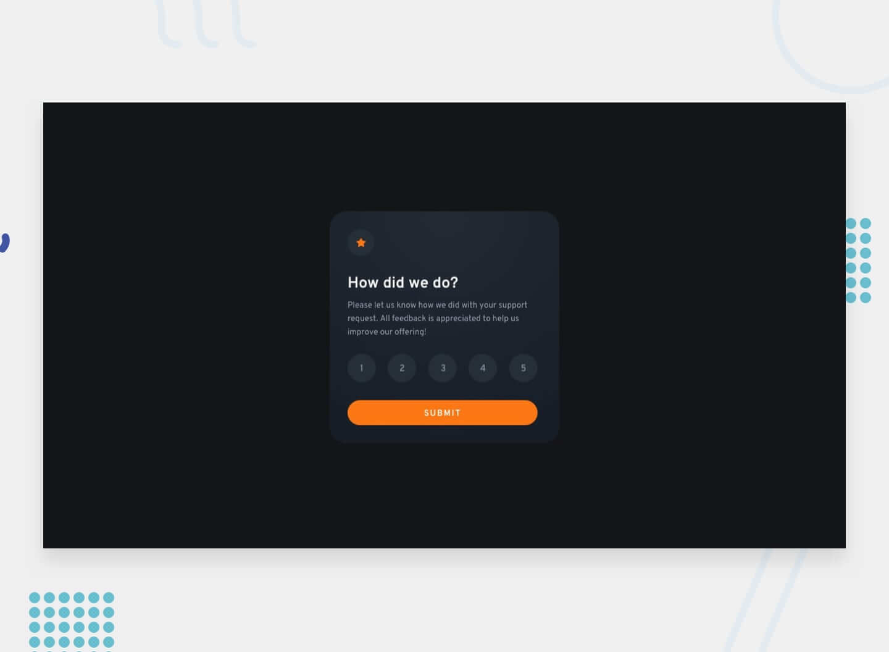

	
	<h1 align="center">Interactive rating component</h1>
	

		Frontend Mentor Challenge
	

	

		
	

	

		<a href="https://interactive-rating-component-three-ebon.vercel.app/">View Demo</a> ·
		<a href="#"> View on frontend mentor</a>
	

	

		
	

## My process

### Built with

-   [Vite](https://vitejs.dev/) - development environment
-   [React](https://reactjs.org/) - JS library
-   [GSAP](https://greensock.com/gsap/) - animation library
-   [Emotion](https://emotion.sh/) - CSS-in-JS library
-   [Sass](https://sass-lang.com/) - CSS preprocessor
-   [PostCSS](https://postcss.org/) - CSS postprocessor
-   [Eslint](https://eslint.org/) - linter
-   [Prettier](https://prettier.io/) - code formatter

### What I learned

-   React Basics
-   CSS-in-JS
-   setting constants and mixins for applying styles
-   ajax post request, error handling, loading animation
-   form validate

### Continued development

-   CSS Interaction
-   CSS Grid
-   Svg icons, image
-   GSAP animation
-   Switch favicon between dark and light modes
-   Displaying webfont using webfont loader
-   Issue-driven development

### Useful resources

-   styled-components
    -   media query
        -   [Media queries with styled components](https://medium.com/@mariokandut/media-queries-with-styled-components-7a93e4c876f2)
        -   [How to use media queries with styled components](https://jsramblings.com/how-to-use-media-queries-with-styled-components/)
    -   mixin
        -   [Advanced Mixins in Styled-Components](https://vegeloper.medium.com/advanced-mixins-in-styled-components-2702d60d730)
-   api mock
    -   [jsonplaceholder](https://jsonplaceholder.typicode.com/)
-   emotion
    -   [After updating eslint-plugin-react, many emotion-related errors occurred.](https://qiita.com/yuto-ono/items/6642b16f720c9e82fef4)
    -   [How to use emotion css prop in vite.](https://dev.to/mehdinajafi/how-to-use-emotion-css-prop-in-vite-39pj)
-   ESLint Error
    -   [resolve Component definition is missing display name](https://qiita.com/masash49/items/36de7fdf12778c1a534a)
-   transitions when switching components
    -   [React Transition Group](https://reactcommunity.org/react-transition-group/)
    -   [How to pass the ref attribute to your own components](https://www.white-space.work/using-react-ref-in-original-compoent/)
    -   [resolve Warning: Function components cannot be given refs. Attempts to access this ref will fail. Did you mean to use React.forwardRef()? Check the render method of Link.](https://qiita.com/tak001/items/fb44aefba5d90745d39e)
    -   [Component definition is missing display name in React](https://bobbyhadz.com/blog/react-component-is-missing-display-name)
-   gsap on react
    -   [Getting Started with GSAP + React.](https://greensock.com/react)
    -   [GSAP + React, Advanced Animation Techniques.](https://greensock.com/react-advanced)
-   animation reference
    -   [The Future of Car Servicing is Here | SPARQ](https://www.joinsparq.com/)
